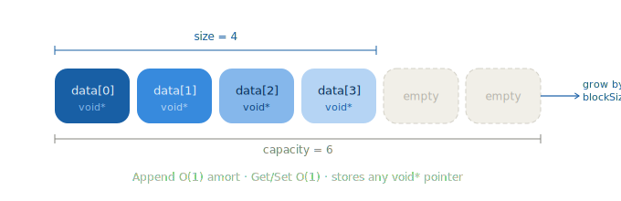
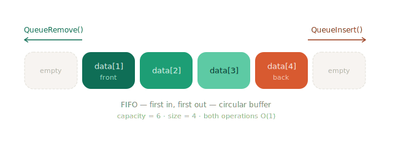
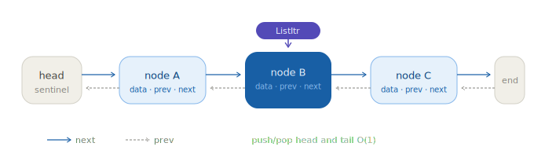
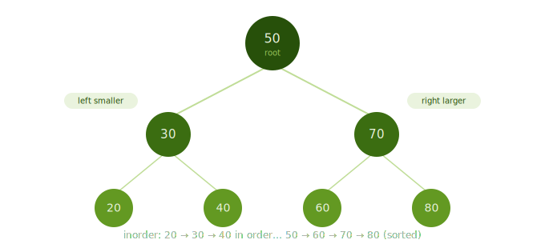
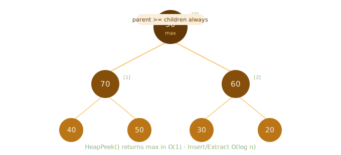
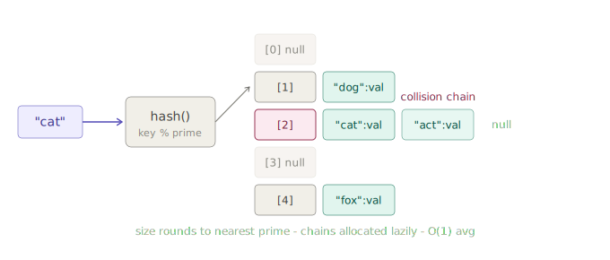

# 🧱 Generic Data Structures in C

> A collection of fully generic, reusable data structure implementations in C — built with `void*` pointers and function pointer callbacks to support any data type.

---

## 📁 Project Structure
gen_DS/
├── gen_alloc/          # Dynamic array (int-based, foundational)
├── gen_vector/         # Generic dynamic array (resizable)
├── gen_stack/          # Generic stack (LIFO)
├── gen_queue/          # Generic queue (FIFO, circular buffer)
├── gen_linked_list/    # Generic doubly linked list with iterators
├── gen_BST/            # Generic binary search tree with sentinel
├── gen_heap/           # Generic max/min heap (built on vector)
└── gen_hash/           # Generic hash map (separate chaining)

---

## 📦 Data Structures

### 🔢 Dynamic Array — `gen_alloc`

A foundational integer dynamic array. Supports automatic resizing with configurable block size.

**API:**
- `DynamicArrayCreate(initialSize, blockSize)` — Allocate a new array
- `DynamicArrayInsert(arr, data)` — Insert an integer (auto-resize if needed)
- `DynamicArrayDelete(arr, &data)` — Remove last element (LIFO)
- `DynamicArrayDestroy(arr)` — Free memory
- `sort_people_by_name(people_array)` — Bubble sort utility for person structs

---

### 📐 Generic Vector — `gen_vector`

A dynamically resizable array supporting any data type through `void*` pointers.



**API:**
- `VectorCreate(initialCapacity, blockSize)` — Create with initial capacity and grow step
- `VectorDestroy(**vector, elementDestroy)` — Deep destroy with optional element destructor
- `VectorAppend(vector, item)` — Add element to the back — O(1) amortized
- `VectorRemove(vector, &pValue)` — Remove from back — O(1)
- `VectorGet(vector, index, &pValue)` — Random access — O(1)
- `VectorSet(vector, index, value)` — Update element at index — O(1)
- `VectorSize(vector)` — Current number of elements
- `VectorCapacity(vector)` — Current allocated capacity
- `VectorForEach(vector, action, context)` — Iterator with early-exit support

---

### 📚 Generic Stack — `gen_stack`

LIFO stack built on top of the generic vector. Grows and shrinks on demand.


**API:**
- `StackCreate(initialCapacity, blockSize)` — Allocate stack
- `StackDestroy(**stack, elementDestroy)` — Free with optional element destructor
- `StackPush(stack, item)` — Push to top — O(1)
- `StackPop(stack, &pValue)` — Pop from top — O(1)
- `StackTop(stack, &pValue)` — Peek at top without removal — O(1)
- `StackSize(stack)` / `StackCapacity(stack)` — Inspect state
- `StackIsEmpty(stack)` — Returns 1 if empty
- `StackPrint(stack, action, context)` — Iterate with user-provided print function

---

### 🔄 Generic Queue — `gen_queue`

FIFO queue with fixed capacity. Implemented as a circular buffer.



**API:**
- `QueueCreate(size)` — Allocate queue of fixed size
- `QueueDestroy(**queue, itemDestroy)` — Free with optional element destructor
- `QueueInsert(queue, item)` — Enqueue — O(1)
- `QueueRemove(queue, &item)` — Dequeue — O(1)
- `QueueIsEmpty(queue)` — Returns non-zero if empty
- `QueueForEach(queue, action, context)` — Iterate with early-exit support

---

### 🔗 Generic Doubly Linked List — `gen_linked_list`

A fully generic doubly linked list with bidirectional iterator support.



**API:**
- `ListCreate()` — Create empty list
- `ListDestroy(**list, elementDestroy)` — Deep destroy
- `ListPushHead(list, item)` / `ListPushTail(list, item)` — O(1) insertions
- `ListPopHead(list)` / `ListPopTail(list)` — O(1) removal
- `ListItrBegin(list)` / `ListItrEnd(list)` — Iterator bounds
- `ListItrNext(itr)` / `ListItrPrev(itr)` — Bidirectional traversal
- `ListItrGet(itr)` / `ListItrSet(itr, element)` — Access and mutation
- `ListItrInsertBefore(itr, element)` — Insert at iterator position
- `ListItrRemove(itr)` — Remove at iterator position
- `ListSize(list)` / `ListIsEmpty(list)` — Size utilities
- `ListItrForEach(begin, end, action, context)` — Ranged iteration

---

### 🌳 Generic Binary Search Tree — `gen_BST`

A sentinel-based BST supporting custom comparison functions. Includes three traversal modes.



**API:**
- `BSTreeCreate(comparator)` — Create with custom comparator (returns -1/0/1)
- `BSTreeDestroy(**tree, destroyer)` — Free with optional element destructor
- `BSTreeInsert(tree, item)` — Insert (no duplicates) — O(log n) avg, O(n) worst
- `BSTreeItrBegin(tree)` / `BSTreeItrEnd(tree)` — In-order bounds
- `BSTreeItrNext(itr)` / `BSTreeItrPrev(itr)` — In-order traversal — O(1)
- `BSTreeItrRemove(itr)` — Remove node and rebalance — O(1)
- `BSTreeItrGet(itr)` — Get element at iterator — O(1)
- `BSTreeForEach(tree, mode, action, context)` — Traversal with 3 modes:
  - `BSTREE_TRAVERSAL_PREORDER`
  - `BSTREE_TRAVERSAL_INORDER`
  - `BSTREE_TRAVERSAL_POSTORDER`

---

### ⛰️ Generic Heap — `gen_heap`

A generic priority queue (max or min heap) built on top of the generic vector.



**API:**
- `HeapBuild(vector, comparator)` — Heapify an existing vector — O(n)
- `HeapDestroy(**heap)` — Free heap (returns underlying vector)
- `HeapInsert(heap, element)` — Insert with sift-up — O(log n)
- `HeapPeek(heap)` — View top element — O(1)
- `HeapExtract(heap)` — Remove and return top — O(log n)
- `HeapSize(heap)` — Current element count
- `HeapForEach(heap, action, context)` — Iterate top-to-bottom

---

### 🗂️ Generic Hash Map — `gen_hash`

A key-value hash map with separate chaining via linked lists. Table size is rounded to the nearest prime for better distribution.



**API:**
- `HashMap_Create(capacity, hashFunc, keysEqualFunc)` — Create map (size → nearest prime)
- `HashMap_Destroy(**map, keyDestroy, valDestroy)` — Deep destroy
- `HashMap_Rehash(map, newCapacity)` — Resize and rehash — O(n)
- `HashMap_Insert(map, key, value)` — Insert key-value pair — O(1) avg
- `HashMap_Remove(map, searchKey, &pKey, &pValue)` — Remove and retrieve — O(1) avg
- `HashMap_Find(map, key, &pValue)` — Lookup by key — O(1) avg
- `HashMap_Size(map)` — Number of stored pairs
- `HashMap_ForEach(map, action, context)` — Iterate all pairs
- `HashMap_GetStatistics(map)` — Debug stats (when `NDEBUG` not defined)

---

## ⏱️ Time Complexity Summary

| Data Structure     | Insert         | Delete       | Search       | Access       | Space |
|--------------------|:--------------:|:------------:|:------------:|:------------:|:-----:|
| Dynamic Array      | O(1) amort.    | O(1)         | O(n)         | O(1)         | O(n)  |
| Vector             | O(1) amort.    | O(1)         | O(n)         | O(1)         | O(n)  |
| Stack              | O(1)           | O(1)         | —            | O(1) top     | O(n)  |
| Queue              | O(1)           | O(1)         | —            | O(1) front   | O(n)  |
| Doubly Linked List | O(1) head/tail | O(1) at itr  | O(n)         | O(n)         | O(n)  |
| BST                | O(log n) avg   | O(1) at itr  | O(log n) avg | O(log n) avg | O(n)  |
| Heap               | O(log n)       | O(log n)     | O(n)         | O(1) top     | O(n)  |
| Hash Map           | O(1) avg       | O(1) avg     | O(1) avg     | O(1) avg     | O(n)  |

---

## 🧬 Architecture & Design

- **Generic via `void*`** — any data type can be stored; the caller manages type safety
- **Function pointer callbacks** — for comparison, equality, hashing, destruction, and iteration
- **Iterator pattern** — BST and Linked List expose opaque iterator types for safe traversal
- **Lazy allocation** — Hash map chains are allocated only when first needed
- **Sentinel nodes** — BST uses a sentinel to simplify edge-case handling

### Generic callback signatures

```c
typedef int    (*Comparator)(void* _left, void* _right);
typedef size_t (*HashFunction)(void* _key);
typedef int    (*EqualityFunction)(void* _firstKey, void* _secondKey);
typedef int    (*ActionFunction)(void* _element, void* _context);
```

---

## 🚀 Usage Example

```c
#include "gen_vector/gen_vector.h"
#include <stdio.h>

int printInt(void* elem, size_t idx, void* ctx) {
    printf("[%zu] = %d\n", idx, *(int*)elem);
    return 1;
}

int main(void) {
    Vector* v = VectorCreate(4, 4);
    int a = 10, b = 20, c = 30;
    VectorAppend(v, &a);
    VectorAppend(v, &b);
    VectorAppend(v, &c);
    VectorForEach(v, printInt, NULL);
    VectorDestroy(&v, NULL);
    return 0;
}
```

---

## 🛠️ Compilation

```bash
gcc -Wall -Wextra -o vector_test gen_vector/gen_vector.c gen_vector/main.c
```

---

## 👤 Author

Built as part of the **Embedded & Real-Time** course —
[Reichman University & Google School of Hi-Tech](https://www.runi.ac.il/en/schools/hi-tech/)
